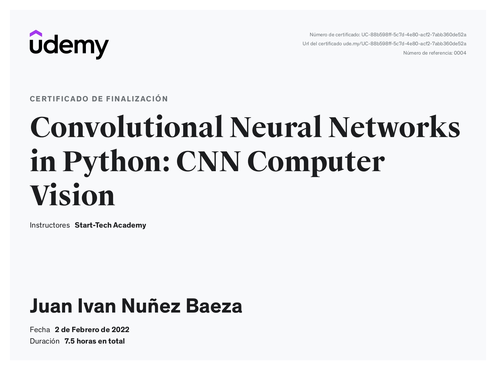

This is a repo to store some courses that I've been taking and also some coding challenges like katas from codewars (SQL, Python, JavaScript...)

Courses:

1.- CNN for Computer Vision with Keras and TensorFlow in Python
https://www.udemy.com/course/cnn-for-computer-vision-with-keras-and-tensorflow-in-python/

Certificate

<figcaption>Certificate</figcaption>

2.- Learning Django:
► https://www.youtube.com/c/pildorasinformaticas/featured

Katas from Codewars:
Coding challenges in different languages and levels.
Profile ► https://www.codewars.com/users/JI_NV